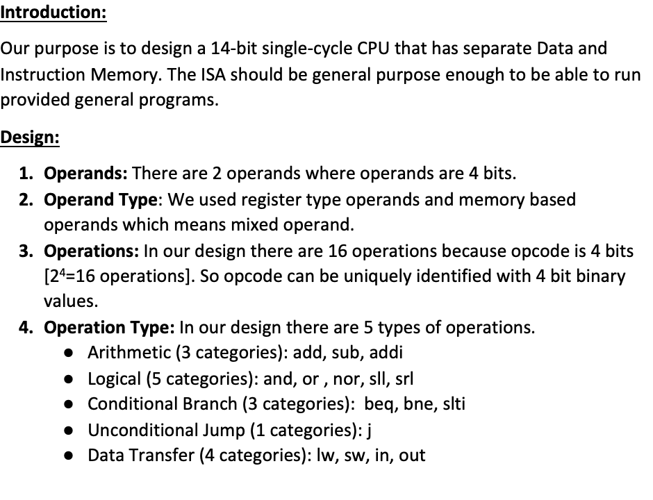
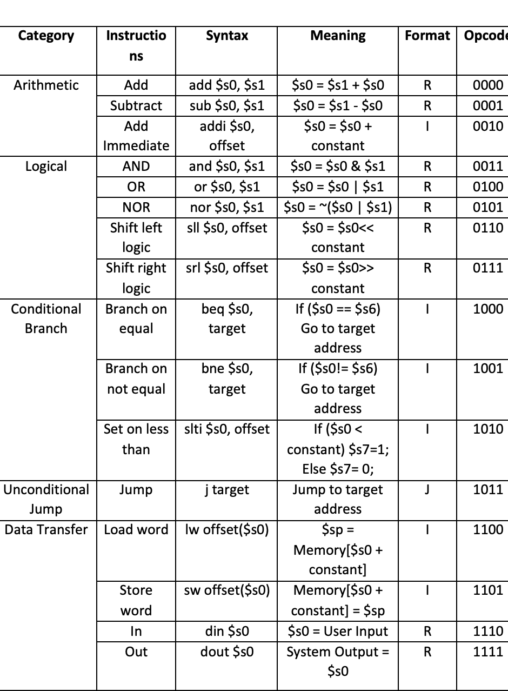

# An-14-bit-RISC-V based Microprocessor-Simulator

### Tools Used: MIPS 
### Programming Language: C++ {for coding & scripting the Assembler} 
### This Project had 3 parts {ISA Design, Assembler Development, Datapath Design}

